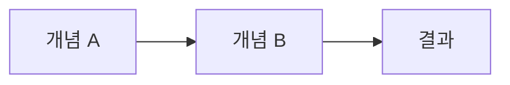

# /blogs

기술 블로그 아티클을 Markdown 형식으로 작성한다.

## Arguments
- $1: 주제 (영문 또는 한글)
- $2: 기술 스택 또는 상세 키워드 (선택)

## Output Format

### Markdown 구조
```markdown
---
title: "아티클 제목"
date: YYYY-MM-DD
tags: [tag1, tag2, tag3]
category: "카테고리"
summary: "한 줄 요약"
---

# 아티클 제목

## 개요
// 주제 소개 및 배경

## 본문
// 기술 내용, 코드 예시, 설명

## 결론
// 핵심 요약 및 활용 방안

## 참고 자료
// 출처 링크
```

## Instructions

### Step 1: 주제 분석
1. 입력된 주제와 키워드를 분석한다
2. 대상 독자 수준을 파악한다 (초급/중급/고급)
3. 아티클 유형을 결정한다:
   - **Tutorial**: 단계별 가이드
   - **Deep Dive**: 기술 심층 분석
   - **Comparison**: 기술 비교
   - **Best Practice**: 실무 팁
   - **Case Study**: 실제 적용 사례
   - **Troubleshooting**: 문제 해결 가이드

### Step 2: 정보 수집
1. Context7 MCP 서버를 활용하여 최신 문서를 조회한다
   ```
   resolve-library-id: 라이브러리 ID 조회
   query-docs: 문서 내용 검색
   ```
2. WebSearch로 최신 트렌드 및 관련 자료를 검색한다
3. 필요시 codebase를 탐색하여 실제 적용 사례를 확인한다

### Step 3: 아티클 작성

#### 제목 작성 규칙
- 명확하고 구체적인 제목
- 검색 가능한 키워드 포함
- 예시:
  - "Laravel 12에서 Redis 캐싱 구현하기"
  - "Tailwind CSS 4 새로운 기능 완벽 가이드"
  - "PostgreSQL vs MySQL: 2024년 실무 비교"

#### 본문 작성 규칙
1. **코드 블록 필수 포함**: 기술 주제에 맞는 예제 코드
2. **단계별 설명**: 복잡한 개념은 순서대로 분해
3. **시각적 요소**: Mermaid 다이어그램, 표 활용
4. **실용적 팁**: 실무에서 바로 적용 가능한 내용

#### 코드 블록 형식
```markdown
```언어
// 코드 예시
```
```

#### 다이어그램 활용


### Step 4: 품질 검토
1. 기술적 정확성 확인
2. 코드 예시 실행 가능 여부
3. 문법 및 맞춤법 검토
4. 링크 유효성 확인

## Article Templates

### Tutorial 템플릿
```markdown
---
title: "[Tutorial] $1 완벽 가이드"
date: {{date}}
tags: [$2, tutorial, guide]
category: "Tutorial"
summary: "$1에 대한 단계별 학습 가이드"
---

# $1 완벽 가이드

## 소개
$1이란 무엇이고 왜 사용하는지 설명합니다.

## 사전 요구사항
- 요구사항 1
- 요구사항 2

## Step 1: 설치 및 설정
// 설치 과정

## Step 2: 기본 사용법
// 기본 코드 예시

## Step 3: 고급 기능
// 심화 내용

## 마무리
// 요약 및 다음 단계

## 참고 자료
- [공식 문서](url)
```

### Deep Dive 템플릿
```markdown
---
title: "[Deep Dive] $1 내부 동작 원리"
date: {{date}}
tags: [$2, deep-dive, internals]
category: "Deep Dive"
summary: "$1의 내부 구조와 동작 원리를 심층 분석합니다"
---

# $1 내부 동작 원리

## 개요
$1의 핵심 개념을 소개합니다.

## 아키텍처
// 전체 구조 설명 + 다이어그램

## 핵심 컴포넌트
### 컴포넌트 1
// 상세 설명

### 컴포넌트 2
// 상세 설명

## 동작 흐름
// 시퀀스 다이어그램 포함

## 성능 고려사항
// 최적화 팁

## 결론
// 핵심 요약

## 참고 자료
- [소스 코드](url)
- [공식 문서](url)
```

### Comparison 템플릿
```markdown
---
title: "$1 vs $2: 어떤 것을 선택할까?"
date: {{date}}
tags: [$1, $2, comparison]
category: "Comparison"
summary: "$1과 $2를 다양한 관점에서 비교 분석합니다"
---

# $1 vs $2 비교 분석

## 개요
두 기술의 등장 배경과 목적을 설명합니다.

## 비교 요약

| 항목 | $1 | $2 |
|------|-----|-----|
| 성능 | - | - |
| 학습 곡선 | - | - |
| 생태계 | - | - |
| 사용 사례 | - | - |

## 상세 비교

### 성능
// 벤치마크 결과

### 개발 경험
// DX 비교

### 생태계 및 커뮤니티
// 라이브러리, 지원 현황

## 언제 무엇을 선택할까?
- **$1 선택 시**: 조건 나열
- **$2 선택 시**: 조건 나열

## 결론
// 최종 권장사항

## 참고 자료
```

### Best Practice 템플릿
```markdown
---
title: "$1 베스트 프랙티스 (2024)"
date: {{date}}
tags: [$2, best-practice, tips]
category: "Best Practice"
summary: "실무에서 검증된 $1 베스트 프랙티스를 공유합니다"
---

# $1 베스트 프랙티스

## 소개
이 가이드에서 다루는 내용을 소개합니다.

## 1. DO: 권장 사항
### 1.1 팁 제목
// 설명 + 코드

### 1.2 팁 제목
// 설명 + 코드

## 2. DON'T: 피해야 할 것
### 2.1 안티패턴 제목
```bad
// 나쁜 예시
```

```good
// 좋은 예시
```

## 3. 체크리스트
- [ ] 항목 1
- [ ] 항목 2
- [ ] 항목 3

## 결론
// 요약

## 참고 자료
```

### Troubleshooting 템플릿
```markdown
---
title: "$1 문제 해결 가이드"
date: {{date}}
tags: [$2, troubleshooting, debug]
category: "Troubleshooting"
summary: "$1 관련 자주 발생하는 문제와 해결 방법"
---

# $1 문제 해결 가이드

## 개요
자주 발생하는 문제들과 해결 방법을 정리합니다.

## 문제 1: 에러 메시지
### 증상
// 증상 설명

### 원인
// 원인 분석

### 해결 방법
```bash
# 해결 명령어
```

## 문제 2: 에러 메시지
### 증상
### 원인
### 해결 방법

## 디버깅 팁
// 일반적인 디버깅 접근법

## 도움 받기
- [GitHub Issues](url)
- [Stack Overflow](url)
- [공식 Discord](url)

## 참고 자료
```

## MCP Tools
- **Context7**: 최신 라이브러리 문서 조회
  - `resolve-library-id`: 라이브러리 ID 확인
  - `query-docs`: 문서 내용 검색
- **WebSearch**: 관련 자료 검색

## Example

### 기본 사용
```
/blogs "Laravel Queue" "Redis, Job Processing"
```

### 비교 아티클
```
/blogs "PostgreSQL vs MySQL" "database, performance"
```

### 트러블슈팅
```
/blogs "Docker 컨테이너 디버깅" "debug, logs"
```

## Workflow

```mermaid
flowchart TD
    A[/blogs 실행] --> B[주제 분석]
    B --> C{아티클 유형 결정}
    C -->|Tutorial| D1[Tutorial 템플릿]
    C -->|Deep Dive| D2[Deep Dive 템플릿]
    C -->|Comparison| D3[Comparison 템플릿]
    C -->|Best Practice| D4[Best Practice 템플릿]
    C -->|Troubleshooting| D5[Troubleshooting 템플릿]
    D1 & D2 & D3 & D4 & D5 --> E[정보 수집]
    E --> F[Context7 문서 조회]
    E --> G[WebSearch 검색]
    F & G --> H[아티클 작성]
    H --> I[품질 검토]
    I --> J[Markdown 출력]
```

## Output

최종 결과물은 Markdown 형식의 블로그 아티클로 제공된다:

1. **프론트매터**: 메타데이터 (title, date, tags, category, summary)
2. **본문**: 구조화된 내용 (개요, 본문, 결론)
3. **코드 블록**: 실행 가능한 예제 코드
4. **다이어그램**: Mermaid 차트 (필요시)
5. **참고 자료**: 출처 및 추가 학습 링크

## Notes
- 모든 코드 예시는 실행 가능해야 함
- 최신 버전 기준으로 작성 (Context7 활용)
- 저작권 준수: 출처 명시 필수
- 한국어로 작성 (기술 용어는 영문 병기 가능)
