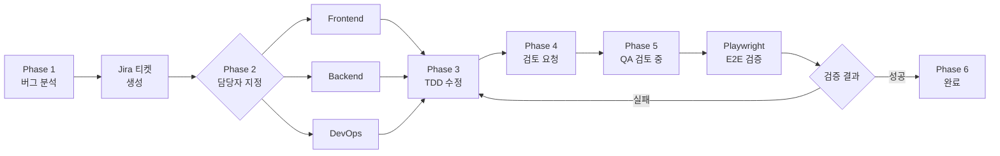

# /bugfix

버그를 분석하고 수정한 후, QA 검증을 거쳐 완료 처리한다.

## Arguments
- $ARGUMENTS: 버그 설명 또는 Sentry/Jira 링크

## Jira 상태 흐름
```
해야 할 일 → 진행 중 → 검토 중 → 완료
(11)         (21)       (31)      (41)
```

## Development Principles

### TDD (Test-Driven Development)
```
1. 버그를 재현하는 테스트 작성 (Red)
2. 버그 수정 코드 작성 (Green)
3. 테스트 통과 확인
```

### Testing Stack
- **Backend**: Pest (Feature Test)
- **Frontend**: Vitest
- **E2E**: Playwright (QA 검증용)

## Workflow



## Instructions

### Phase 1: 버그 분석
버그의 원인과 영향 범위를 분석한다:

1. **정보 수집**
   - Sentry 에러 로그 확인 (`mcp__sentry__get_issue_details`)
   - 재현 단계 파악
   - 영향받는 기능 식별

2. **원인 분석**
   - 코드베이스 탐색 (Task tool + Explore agent)
   - 관련 파일 및 함수 식별
   - Root Cause 파악

3. **Jira 티켓 생성**
   ```
   프로젝트: ECS
   유형: Bug
   제목: [Bug] 버그 요약
   설명:
     - 재현 단계
     - 예상 동작
     - 실제 동작
     - 원인 분석
     - 영향 범위
   ```

4. 상태를 "진행 중"(21)으로 변경

### Phase 2: 담당자 지정
버그 유형에 따라 담당 팀을 결정한다:

1. **AskUserQuestion으로 담당자 확인**
   - Frontend: UI/UX, 클라이언트 로직
   - Backend: API, 데이터베이스, 서버 로직
   - DevOps: 인프라, 배포, 설정

2. 담당자에게 Jira 티켓 할당

### Phase 3: TDD 버그 수정
담당 팀이 TDD로 버그를 수정한다:

**Frontend:**
```bash
# 1. 버그 재현 테스트 작성
npm run test -- --watch

# 2. 버그 수정
# 3. 테스트 통과 확인
npm run test
```

**Backend:**
```bash
# 1. 버그 재현 테스트 작성
./vendor/bin/pest tests/Feature/XxxTest.php

# 2. 버그 수정
# 3. 테스트 통과 확인
./vendor/bin/pest --parallel
```

**DevOps:**
- 설정 파일 수정
- 인프라 변경 적용
- 모니터링 확인

### Phase 4: 검토 요청
수정 완료 후 QA 팀에 검토를 요청한다:

1. **코드 커밋**
   ```bash
   git add .
   git commit -m "fix(ECS-XX): 버그 수정 내용

   - 수정 상세 1
   - 수정 상세 2

   Co-Authored-By: Claude Opus 4.5 <noreply@anthropic.com>"
   ```

2. **Jira 티켓 업데이트**
   - `jira_add_comment`: 수정 내용 기록
   - `jira_transition_issue`: "검토 중"(31)으로 변경

3. **QA 팀에 알림**
   - 검토 요청 내용 정리
   - 테스트 방법 안내

### Phase 5: QA 검토
QA 팀이 버그 수정을 검증한다:

1. **수동 테스트**
   - 재현 단계 확인
   - 수정된 동작 검증
   - 사이드 이펙트 확인

2. **Playwright E2E 테스트**
   ```javascript
   // 버그 시나리오 테스트
   test('버그 수정 검증', async ({ page }) => {
     // 1. 버그 재현 단계 수행
     // 2. 수정된 동작 확인
     // 3. 관련 기능 정상 동작 확인
   });
   ```

3. **검증 결과 기록**
   - Jira 티켓에 검증 결과 코멘트
   - 스크린샷/녹화 첨부 (필요 시)

### Phase 6: 완료 처리
검증 성공 시 버그를 완료 처리한다:

1. **검증 실패 시**
   - Phase 3으로 돌아가 재수정
   - 실패 사유 Jira 코멘트 추가

2. **검증 성공 시**
   - `jira_transition_issue`: "완료"(41)로 변경
   - **PR 생성 (필수)**
     ```bash
     git push -u origin bugfix/ECS-XX
     gh pr create --title "fix(ECS-XX): 버그 수정 요약" --body "## Summary\n- 수정 내용"
     ```
   - PR 리뷰 후 머지

> ⚠️ **직접 push 금지**: master 브랜치에 직접 push하지 않음. 반드시 PR을 통해 머지.

## MCP Tools

### Sentry
- `mcp__sentry__get_issue_details`: 에러 상세 정보
- `mcp__sentry__analyze_issue_with_seer`: AI 원인 분석

### Jira
- `mcp__atlassian__jira_create_issue`: 버그 티켓 생성
- `mcp__atlassian__jira_add_comment`: 진행 상황 기록
- `mcp__atlassian__jira_transition_issue`: 상태 변경
- `mcp__atlassian__jira_update_issue`: 담당자 할당

### Playwright
- `mcp__playwright__browser_navigate`: 페이지 이동
- `mcp__playwright__browser_snapshot`: 상태 확인
- `mcp__playwright__browser_click`: 액션 수행
- `mcp__playwright__browser_fill_form`: 폼 입력

## Git Worktree 규칙

**이유**: 병렬 작업 시 다른 브랜치에 영향을 주지 않기 위함

```bash
# 1. worktree 디렉토리 존재 여부 확인
ls ../laravel-commu-worktrees/ 2>/dev/null || mkdir -p ../laravel-commu-worktrees

# 2. git worktree로 새 브랜치 생성
git worktree add -b bugfix/ECS-XX ../laravel-commu-worktrees/bugfix-ECS-XX master

# 3. 해당 worktree 디렉토리에서 작업 수행
cd ../laravel-commu-worktrees/bugfix-ECS-XX
```

**Worktree 제거 시점**: PR이 머지된 후 제거
```bash
git worktree remove ../laravel-commu-worktrees/bugfix-ECS-XX
```

### 커밋 메시지
```
fix(ECS-XX): 버그 수정 요약

- 상세 내용

Co-Authored-By: Claude Opus 4.5 <noreply@anthropic.com>
```

## Example

### 입력 예시
```
/bugfix 로그인 페이지에서 잘못된 비밀번호 입력 시 에러 메시지가 표시되지 않음
```

### 실행 순서

1. **Phase 1: 버그 분석**
   - 코드베이스 탐색으로 원인 파악
   - Jira 티켓 ECS-125 생성
   - 상태: "진행 중"(21)

2. **Phase 2: 담당자 지정**
   - AskUserQuestion: "Frontend / Backend / DevOps?"
   - 사용자 선택: "Frontend"
   - Frontend 담당으로 할당

3. **Phase 3: TDD 버그 수정**
   - Vitest 테스트 작성 (에러 메시지 표시 검증)
   - LoginForm 컴포넌트 수정
   - 테스트 통과 확인

4. **Phase 4: 검토 요청**
   - 코드 커밋
   - Jira 코멘트 추가
   - 상태: "검토 중"(31)

5. **Phase 5: QA 검토**
   - Playwright로 로그인 시나리오 테스트
   - 잘못된 비밀번호 입력 시 에러 메시지 확인

6. **Phase 6: 완료**
   - 검증 성공
   - 상태: "완료"(41)
   - PR 생성 및 머지

## Output

### Jira 티켓 구조
```
ECS-125 [Bug] 로그인 에러 메시지 미표시
├── 상태: 완료
├── 담당자: Frontend
├── 코멘트:
│   ├── 원인 분석 결과
│   ├── 수정 내용
│   └── QA 검증 결과
└── 관련 커밋: fix(ECS-125): ...
```

### 검증 체크리스트
- [ ] 버그 재현 테스트 작성
- [ ] 버그 수정 완료
- [ ] 단위 테스트 통과
- [ ] Playwright E2E 테스트 통과
- [ ] Jira 상태 "완료" 변경
