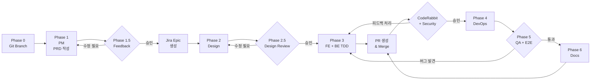

# /new-feature

새로운 기능을 기획하고 모든 팀 에이전트가 협업하여 작업을 정의하고 개발한다.

## Arguments
- $1: 기능명 (영문, kebab-case)
- $2: 기능 설명

## Development Principles

### TDD (Test-Driven Development) - Backend/Frontend 필수
```
Red → Green → Refactor
1. PM/QA 요구사항을 테스트로 작성 (실패)
   - Backend: Pest
   - Frontend: Vitest
2. 테스트를 통과시키는 코드 작성
3. 코드 리팩토링 (테스트 유지)
```

### Testing Stack - Backend/Frontend 필수

**Backend:**
- **Pest**: PHP 테스트 프레임워크 (간결한 문법)
- **Testcontainers**: 실제 DB/Redis 컨테이너로 통합 테스트
- **Parallel Testing**: `--parallel` 옵션으로 병렬 실행

**Frontend:**
- **Vitest**: Vite 기반 테스트 프레임워크
- **Testing Library**: 컴포넌트 테스트
- **Playwright**: E2E 테스트 (필요 시)

### Documentation Management - Backend 필수
```
1. [Git] 작업 전 feature 브랜치 생성
2. [Commit] Jira 티켓당 1 commit
3. [Jira] 완료 시 작업 내용 코멘트 기록
4. [Confluence] 상세 기술 문서 작성
```

## Agents

| Phase | Agent | Context File |
|-------|-------|--------------|
| 0 | Git | 브랜치 생성 |
| 1 | PM | `.claude/agents/pm.md` |
| 1.5 | Feedback | 요구사항 피드백 (승인 시 진행, 수정 시 Phase 1 반복) |
| 2 | Design | `.claude/agents/design.md` |
| 2.5 | Design Review | 디자인 스펙 검토 (승인 시 진행, 수정 시 Phase 2 반복) |
| 3 | Frontend | `.claude/agents/frontend.md` |
| 3 | Backend (TDD) | `.claude/agents/backend.md` |
| 3.5 | PR & Code Review | PR 생성 + CodeRabbit 피드백 Jira 티켓화 |
| 4 | DevOps | `.claude/agents/devops.md` |
| 5 | QA | `.claude/agents/qa.md` |
| 6 | Docs | `.claude/agents/docs.md` |

## Instructions

### Phase 0: Git Branch
작업 시작 전 feature 브랜치를 생성한다:

```bash
# 1. feature 브랜치 생성
git checkout -b feature/$1 master
```

### Phase 1: PM Agent
`.claude/agents/pm.md` 컨텍스트를 읽고 다음을 수행하라:

1. 요구사항 분석 및 정리
2. 팀별 의존성 파악
3. **Confluence PRD 문서 생성** (DOCS 스페이스)
   - 기능 개요
   - 사용자 스토리
   - 기능 요구사항
   - 비기능 요구사항
   - 의존성 및 제약사항
4. PRD 문서 링크를 사용자에게 공유

### Phase 1.5: Feedback
사용자에게 PRD 문서에 대한 피드백을 요청한다:

1. PRD 문서 검토 요청
2. 피드백 수집 (AskUserQuestion 사용)
   - **승인**: Phase 2로 진행
   - **수정 필요**: Phase 1로 돌아가 PRD 수정
3. 피드백 승인 후:
   - Jira Epic 생성 (ECS 프로젝트)
     - 제목: `[Epic] $1 - $2`
     - 유형: Epic
   - Jira Epic과 Confluence PRD 연동

### Phase 2: Design Agent
`.claude/agents/design.md` 컨텍스트를 읽고 다음을 수행하라:

1. UX 플로우 설계
2. UI 컴포넌트 목록 정의
3. Tailwind 클래스 가이드
4. Jira 디자인 Task 생성 (Epic 하위)
5. Confluence 디자인 스펙 문서 작성

### Phase 2.5: Design Review
사용자에게 디자인 스펙에 대한 피드백을 요청한다:

1. 디자인 스펙 문서 검토 요청
   - UX 플로우 적절성
   - UI 컴포넌트 구성
   - 사용성 및 접근성
2. 피드백 수집 (AskUserQuestion 사용)
   - **승인**: Phase 3으로 진행
   - **수정 필요**: Phase 2로 돌아가 디자인 수정
3. 승인 후 개발 단계로 진행

### Phase 3: Frontend/Backend Agent (병렬 실행)

**Frontend** (`.claude/agents/frontend.md`) - TDD 필수:

*TDD 개발 순서 (Vitest 사용):*
1. PM/QA 요구사항을 Vitest 테스트로 작성 (Red)
2. 테스트 통과를 위한 컴포넌트 구현 (Green)
3. 코드 리팩토링 (Refactor)

*작업 내용:*
1. 컴포넌트 목록 정의
2. **Vitest 테스트 먼저 작성** (tests/js/)
3. 컴포넌트 구현
4. 페이지 구현 계획
5. API 연동 포인트 정의
6. 테스트 통과 확인 (`npm run test`)
7. Jira Frontend Tasks 생성 및 업데이트

*Testing:*
```bash
npm run test              # 테스트 실행
npm run test:coverage     # 커버리지 검증
```

*Documentation:*
- 각 티켓 완료 시 `jira_add_comment`로 작업 내용 기록

**Backend** (`.claude/agents/backend.md`) - TDD 필수:

*TDD 개발 순서 (Pest 사용):*
1. PM/QA 요구사항을 Pest Feature 테스트로 작성 (Red)
2. 테스트 통과를 위한 코드 구현 (Green)
3. 코드 리팩토링 (Refactor)

*작업 내용:*
1. API 엔드포인트 설계
2. DB 스키마 설계
3. **Pest 테스트 먼저 작성** (tests/Feature/)
4. 마이그레이션/모델/컨트롤러 구현
5. 테스트 통과 확인 (`./vendor/bin/pest --parallel`)
6. Jira Backend Tasks 생성 및 업데이트

*Testing:*
```bash
./vendor/bin/pest --parallel           # 병렬 테스트 실행
./vendor/bin/pest --coverage --min=80  # 커버리지 검증
```

*Documentation:*
- 각 티켓 완료 시 `jira_add_comment`로 작업 내용 기록
- Confluence에 API 문서 작성

### Phase 3.5: PR & Code Review
Frontend/Backend 개발 완료 후 PR을 생성하고 코드 리뷰를 진행한다:

1. **PR 생성**
   - `gh pr create` 명령으로 PR 생성
   - PR 제목: `feat(ECS-XX): $1 - $2`
   - PR 본문에 관련 Jira 티켓 링크 포함

2. **CodeRabbit 리뷰 대기**
   - CodeRabbit AI가 자동으로 코드 리뷰 수행
   - 리뷰 완료까지 대기

3. **Security Review**
   - OWASP Top 10 체크리스트 검토
   - 민감 정보 노출 여부 확인 (API 키, 비밀번호 등)
   - SQL Injection, XSS, CSRF 취약점 검토
   - 인증/인가 로직 검증
   - 보안 이슈 발견 시 Jira Task 생성 (라벨: `security`)

4. **CodeRabbit 피드백 Jira 티켓화**
   - CodeRabbit의 피드백/comment를 분석
   - 각 피드백에 대해 Jira Task 생성 (Epic 하위)
     - 제목: `[CodeReview] 피드백 요약`
     - 설명: CodeRabbit comment 내용
     - 라벨: `code-review`

5. **사용자 결정 요청** (AskUserQuestion 사용)
   - 생성된 Jira 티켓 목록 제시 (코드 리뷰 + 보안 이슈)
   - 각 피드백에 대해 처리 여부 확인:
     - **처리**: 해당 티켓 작업 진행
     - **무시**: 티켓 종료 (사유 코멘트)
     - **보류**: 추후 처리

6. 승인된 피드백 처리 완료 후 Phase 4로 진행

### Phase 4: DevOps Agent
`.claude/agents/devops.md` 컨텍스트를 읽고 다음을 수행하라:

1. 인프라 변경 사항 파악
2. 환경 설정 계획
3. 배포 파이프라인 업데이트 필요 여부
4. Jira DevOps Tasks 생성

### Phase 5: QA Agent
`.claude/agents/qa.md` 컨텍스트를 읽고 다음을 수행하라:

1. 테스트 시나리오 정의
2. 인수 기준 작성
3. QA 체크리스트 생성
4. Jira QA Tasks 생성
5. Confluence 테스트 문서 작성
6. **E2E 테스트 실행** (Playwright)
   - 통합 시나리오 검증
   - 크로스 브라우저 테스트
7. **QA 결과 검토**
   - **통과**: Phase 6으로 진행
   - **실패**: 버그 Jira 티켓 생성 → Phase 3으로 돌아가 수정
     - 버그 수정 후 Phase 3.5 (PR & Review) 다시 진행

### Phase 6: Docs Agent
`.claude/agents/docs.md` 컨텍스트를 읽고 다음을 수행하라:

1. 전체 문서 구조 검토
2. 아키텍처 다이어그램 추가 (Mermaid)
3. API 문서 템플릿 준비
4. 문서 간 링크 연결

## Output

### Jira (ECS 프로젝트)
```
Epic: ECS-XX ($1)
├── [PM] 요구사항 정의
├── [Design] UX/UI 설계
├── [Frontend] 컴포넌트 개발
├── [Backend] API 개발
├── [DevOps] 인프라 설정
└── [QA] 테스트 수행
```

### Confluence (DOCS 스페이스)
```
$1/
├── 기능 명세서
├── 디자인 스펙
├── API 문서
└── 테스트 계획
```

## Workflow



> ⚠️ **필수 규칙**: 직접 git push 금지. 모든 변경사항은 반드시 PR을 통해 머지.

### Phase 7: PR 생성 및 머지
모든 작업 완료 후 PR을 생성하여 머지한다:

```bash
# 1. 원격 브랜치로 push
git push -u origin feature/$1

# 2. PR 생성 (필수)
gh pr create --title "feat(ECS-XX): $1 - $2" --body "## Summary
- 기능 설명

## Related
- Jira Epic: ECS-XX
- Confluence: [PRD 링크]

## Test
- [ ] 단위 테스트 통과
- [ ] E2E 테스트 통과"

# 3. PR 리뷰 후 머지
```

**⚠️ 직접 master push 금지**: 반드시 PR을 통해서만 머지

## Git Commit 규칙

### Branch Naming
```
feature/$1           # 새 기능
bugfix/ECS-XX        # 버그 수정
hotfix/ECS-XX        # 긴급 수정
```

### Commit Message
```
feat(ECS-XX): 작업 내용 요약

- 상세 내용 1
- 상세 내용 2

Jira: ECS-XX
```

### 티켓당 1 Commit
각 Jira 티켓 완료 시:
1. 해당 티켓 작업 내용만 커밋
2. `jira_add_comment`로 작업 결과 기록
3. `jira_transition_issue`로 상태 변경

## Example

```
/new-feature user-authentication "사용자 인증 기능 (로그인/회원가입)"
```

실행 순서:
1. **Git** → `feature/user-authentication` 브랜치 생성
2. **PM Agent** → Confluence PRD 문서 작성 (요구사항 정리)
3. **Feedback** → PRD 검토 요청
   - 승인 시: Jira Epic ECS-XX 생성 후 Phase 2로 진행
   - 수정 필요 시: Phase 1로 돌아가 PRD 수정
4. **Design Agent** → 로그인/회원가입 UI 스펙
5. **Design Review** → 디자인 스펙 검토
   - 승인 시: Phase 3으로 진행
   - 수정 필요 시: Phase 2로 돌아가 디자인 수정
6. **Frontend Agent (TDD)**:
   - Vitest 테스트 먼저 작성 (LoginForm.test.ts, RegisterForm.test.ts)
   - 컴포넌트 구현
   - 테스트 통과 확인 (`npm run test`)
   - 티켓별 커밋 + Jira 코멘트
7. **Backend Agent (TDD)**:
   - Pest 테스트 먼저 작성 (LoginTest, RegisterTest)
   - Auth API 구현 (Testcontainers로 DB 검증)
   - 테스트 통과 확인 (`pest --parallel`)
   - 티켓별 커밋 + Jira 코멘트
8. **PR & Code Review + Security**:
   - PR 생성 (`gh pr create`)
   - CodeRabbit 자동 리뷰 + Security Review
   - 피드백/보안 이슈를 Jira 티켓으로 생성
   - 사용자에게 처리 여부 확인 (처리/무시/보류)
   - 승인된 피드백 처리 후 다음 단계 진행
9. **DevOps Agent** → 세션/토큰 설정 Task
10. **QA Agent** → E2E 테스트 + 인증 테스트 시나리오
    - 통과 시: Phase 6으로 진행
    - 버그 발견 시: Jira 티켓 생성 → Phase 3으로 돌아가 수정
11. **Docs Agent** → 인증 문서 정리
12. **PR 생성 및 머지** → `gh pr create` → 리뷰 후 머지

### Backend TDD 예시 코드 (Pest)
```php
// tests/Feature/Auth/LoginTest.php
<?php

uses(Tests\TestCase::class);
uses(Illuminate\Foundation\Testing\RefreshDatabase::class);

describe('Login API', function () {
    it('로그인 성공 시 토큰을 반환한다', function () {
        $user = User::factory()->create([
            'email' => 'test@example.com',
            'password' => bcrypt('password'),
        ]);

        $response = $this->postJson('/api/login', [
            'email' => 'test@example.com',
            'password' => 'password',
        ]);

        $response->assertStatus(200)
            ->assertJsonStructure(['token']);
    });

    it('잘못된 비밀번호로 로그인 실패', function () {
        User::factory()->create(['email' => 'test@example.com']);

        $response = $this->postJson('/api/login', [
            'email' => 'test@example.com',
            'password' => 'wrong-password',
        ]);

        $response->assertStatus(401);
    });
});
```

### Frontend TDD 예시 코드 (Vitest)
```typescript
// tests/js/components/LoginForm.test.ts
import { describe, it, expect, vi } from 'vitest'
import { render, screen, fireEvent } from '@testing-library/vue'
import LoginForm from '@/components/LoginForm.vue'

describe('LoginForm', () => {
    it('이메일과 비밀번호 입력 필드가 렌더링된다', () => {
        render(LoginForm)

        expect(screen.getByLabelText('이메일')).toBeInTheDocument()
        expect(screen.getByLabelText('비밀번호')).toBeInTheDocument()
    })

    it('폼 제출 시 onSubmit 이벤트가 발생한다', async () => {
        const { emitted } = render(LoginForm)

        await fireEvent.update(screen.getByLabelText('이메일'), 'test@example.com')
        await fireEvent.update(screen.getByLabelText('비밀번호'), 'password')
        await fireEvent.click(screen.getByRole('button', { name: '로그인' }))

        expect(emitted().submit[0]).toEqual([{
            email: 'test@example.com',
            password: 'password'
        }])
    })

    it('이메일 형식이 잘못되면 에러 메시지를 표시한다', async () => {
        render(LoginForm)

        await fireEvent.update(screen.getByLabelText('이메일'), 'invalid-email')
        await fireEvent.click(screen.getByRole('button', { name: '로그인' }))

        expect(screen.getByText('올바른 이메일 형식이 아닙니다')).toBeInTheDocument()
    })
})
```
