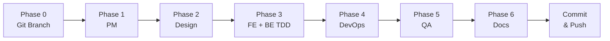

# /new-feature

새로운 기능을 기획하고 모든 팀 에이전트가 협업하여 작업을 정의하고 개발한다.

## Arguments
- $1: 기능명 (영문, kebab-case)
- $2: 기능 설명

## Development Principles

### TDD (Test-Driven Development) - Backend 필수
```
Red → Green → Refactor
1. PM/QA 요구사항을 Pest 테스트로 작성 (실패)
2. 테스트를 통과시키는 코드 작성
3. 코드 리팩토링 (테스트 유지)
```

### Testing Stack - Backend 필수
- **Pest**: PHP 테스트 프레임워크 (간결한 문법)
- **Testcontainers**: 실제 DB/Redis 컨테이너로 통합 테스트
- **Parallel Testing**: `--parallel` 옵션으로 병렬 실행

### Documentation Management - Backend 필수
```
1. [Git] 작업 전 feature 브랜치 생성
2. [Commit] Jira 티켓당 1 commit
3. [Jira] 완료 시 작업 내용 코멘트 기록
4. [Confluence] 상세 기술 문서 작성
```

## Agents

| Phase | Agent | Context File |
|-------|-------|--------------|
| 0 | Git | 브랜치 생성 |
| 1 | PM | `.claude/agents/pm.md` |
| 2 | Design | `.claude/agents/design.md` |
| 3 | Frontend | `.claude/agents/frontend.md` |
| 3 | Backend (TDD) | `.claude/agents/backend.md` |
| 4 | DevOps | `.claude/agents/devops.md` |
| 5 | QA | `.claude/agents/qa.md` |
| 6 | Docs | `.claude/agents/docs.md` |

## Instructions

### Phase 0: Git Branch
작업 시작 전 feature 브랜치를 생성한다:
```bash
git checkout -b feature/$1
```

### Phase 1: PM Agent
`.claude/agents/pm.md` 컨텍스트를 읽고 다음을 수행하라:

1. Jira Epic 생성 (ECS 프로젝트)
   - 제목: `[Epic] $1 - $2`
   - 유형: Epic
2. 요구사항 분석 및 정리
3. 팀별 의존성 파악
4. Confluence 기능 명세서 생성 (DOCS 스페이스)
5. Jira Epic과 Confluence 페이지 연동

### Phase 2: Design Agent
`.claude/agents/design.md` 컨텍스트를 읽고 다음을 수행하라:

1. UX 플로우 설계
2. UI 컴포넌트 목록 정의
3. Tailwind 클래스 가이드
4. Jira 디자인 Task 생성 (Epic 하위)
5. Confluence 디자인 스펙 문서 작성

### Phase 3: Frontend/Backend Agent (병렬 실행)

**Frontend** (`.claude/agents/frontend.md`):
1. 컴포넌트 목록 정의
2. 페이지 구현 계획
3. API 연동 포인트 정의
4. Jira Frontend Tasks 생성

**Backend** (`.claude/agents/backend.md`) - TDD 필수:

*TDD 개발 순서 (Pest 사용):*
1. PM/QA 요구사항을 Pest Feature 테스트로 작성 (Red)
2. 테스트 통과를 위한 코드 구현 (Green)
3. 코드 리팩토링 (Refactor)

*작업 내용:*
1. API 엔드포인트 설계
2. DB 스키마 설계
3. **Pest 테스트 먼저 작성** (tests/Feature/)
4. 마이그레이션/모델/컨트롤러 구현
5. 테스트 통과 확인 (`./vendor/bin/pest --parallel`)
6. Jira Backend Tasks 생성 및 업데이트

*Testing:*
```bash
./vendor/bin/pest --parallel           # 병렬 테스트 실행
./vendor/bin/pest --coverage --min=80  # 커버리지 검증
```

*Documentation:*
- 각 티켓 완료 시 `jira_add_comment`로 작업 내용 기록
- Confluence에 API 문서 작성

### Phase 4: DevOps Agent
`.claude/agents/devops.md` 컨텍스트를 읽고 다음을 수행하라:

1. 인프라 변경 사항 파악
2. 환경 설정 계획
3. 배포 파이프라인 업데이트 필요 여부
4. Jira DevOps Tasks 생성

### Phase 5: QA Agent
`.claude/agents/qa.md` 컨텍스트를 읽고 다음을 수행하라:

1. 테스트 시나리오 정의
2. 인수 기준 작성
3. QA 체크리스트 생성
4. Jira QA Tasks 생성
5. Confluence 테스트 문서 작성

### Phase 6: Docs Agent
`.claude/agents/docs.md` 컨텍스트를 읽고 다음을 수행하라:

1. 전체 문서 구조 검토
2. 아키텍처 다이어그램 추가 (Mermaid)
3. API 문서 템플릿 준비
4. 문서 간 링크 연결

## Output

### Jira (ECS 프로젝트)
```
Epic: ECS-XX ($1)
├── [PM] 요구사항 정의
├── [Design] UX/UI 설계
├── [Frontend] 컴포넌트 개발
├── [Backend] API 개발
├── [DevOps] 인프라 설정
└── [QA] 테스트 수행
```

### Confluence (DOCS 스페이스)
```
$1/
├── 기능 명세서
├── 디자인 스펙
├── API 문서
└── 테스트 계획
```

## Workflow



## Git Commit 규칙

### Branch Naming
```
feature/$1           # 새 기능
bugfix/ECS-XX        # 버그 수정
hotfix/ECS-XX        # 긴급 수정
```

### Commit Message
```
feat(ECS-XX): 작업 내용 요약

- 상세 내용 1
- 상세 내용 2

Jira: ECS-XX
```

### 티켓당 1 Commit
각 Jira 티켓 완료 시:
1. 해당 티켓 작업 내용만 커밋
2. `jira_add_comment`로 작업 결과 기록
3. `jira_transition_issue`로 상태 변경

## Example

```
/new-feature user-authentication "사용자 인증 기능 (로그인/회원가입)"
```

실행 순서:
1. **Git** → `feature/user-authentication` 브랜치 생성
2. **PM Agent** → Epic ECS-XX 생성, 요구사항 문서화
3. **Design Agent** → 로그인/회원가입 UI 스펙
4. **Frontend Agent** → Blade 컴포넌트 Task
5. **Backend Agent (TDD)**:
   - Pest 테스트 먼저 작성 (LoginTest, RegisterTest)
   - Auth API 구현 (Testcontainers로 DB 검증)
   - 테스트 통과 확인 (`pest --parallel`)
   - 티켓별 커밋 + Jira 코멘트
6. **DevOps Agent** → 세션/토큰 설정 Task
7. **QA Agent** → 인증 테스트 시나리오
8. **Docs Agent** → 인증 문서 정리
9. **Git** → PR 생성 또는 merge

### Backend TDD 예시 코드 (Pest)
```php
// tests/Feature/Auth/LoginTest.php
<?php

uses(Tests\TestCase::class);
uses(Illuminate\Foundation\Testing\RefreshDatabase::class);

describe('Login API', function () {
    it('로그인 성공 시 토큰을 반환한다', function () {
        $user = User::factory()->create([
            'email' => 'test@example.com',
            'password' => bcrypt('password'),
        ]);

        $response = $this->postJson('/api/login', [
            'email' => 'test@example.com',
            'password' => 'password',
        ]);

        $response->assertStatus(200)
            ->assertJsonStructure(['token']);
    });

    it('잘못된 비밀번호로 로그인 실패', function () {
        User::factory()->create(['email' => 'test@example.com']);

        $response = $this->postJson('/api/login', [
            'email' => 'test@example.com',
            'password' => 'wrong-password',
        ]);

        $response->assertStatus(401);
    });
});
```
