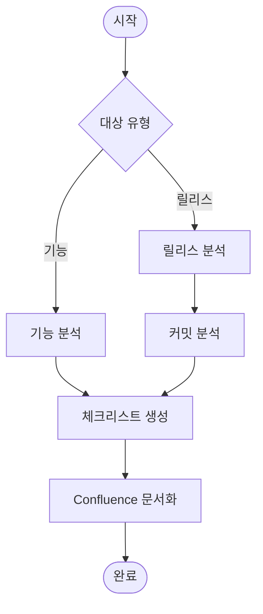

# /qa:checklist

기능 또는 릴리스에 대한 QA 체크리스트를 생성한다. 배포 전 최종 검증용 체크리스트를 제공한다.

## Arguments

- $1: 대상 (기능명, 티켓 번호, 또는 'release')
- $2: 버전 (release인 경우 필수, 예: 1.2.0)

## Workflow



## MCP Tools

### Jira
- `jira_search`: 릴리스 포함 이슈 조회
- `jira_get_issue`: 상세 정보 조회

### Confluence
- `confluence_create_page`: 체크리스트 페이지 생성

## Instructions

### Step 1: 대상 분석

#### 기능 체크리스트
- Jira 티켓 분석
- 변경된 파일 확인

#### 릴리스 체크리스트
- 마지막 릴리스 이후 커밋 분석
- 포함된 Jira 티켓 수집

### Step 2: 체크리스트 항목 생성

#### 카테고리
1. **기능 테스트** - 새 기능/기존 기능
2. **UI/UX 테스트** - 디자인/반응형/접근성
3. **API 테스트** - 엔드포인트/에러 처리
4. **보안 테스트** - 인증/입력값 검증
5. **성능 테스트** - 로드 시간/응답 시간

### Step 3: 문서화

Confluence에 체크리스트 페이지 생성

## Checklist Template

### 기능 체크리스트

```markdown
# {기능명} QA 체크리스트

**대상**: {기능명 / ECS-XXX}
**작성일**: YYYY-MM-DD
**상태**: 진행중 / 완료

---

## 1. 기능 테스트
- [ ] {기능 1} 정상 동작
- [ ] {기능 2} 정상 동작
- [ ] 에러 상황 처리

## 2. UI/UX 테스트
- [ ] 디자인 스펙 일치
- [ ] 반응형 (Desktop/Tablet/Mobile)
- [ ] 접근성 (키보드/스크린리더)

## 3. API 테스트
- [ ] 정상 응답 (200, 201)
- [ ] 에러 응답 (4xx, 5xx)
- [ ] 인증/인가

## 4. 보안 테스트
- [ ] 입력값 검증
- [ ] 권한 검사

## 5. 성능 테스트
- [ ] 페이지 로드 < 2s
- [ ] API 응답 < 500ms

---

## QA 결론
- [ ] **승인**
- [ ] **조건부 승인**
- [ ] **반려**
```

### 릴리스 체크리스트

```markdown
# Release v{VERSION} QA 체크리스트

**버전**: v{VERSION}
**릴리스 예정일**: YYYY-MM-DD

---

## 배포 전 체크리스트

### 코드 품질
- [ ] 모든 테스트 통과
- [ ] 코드 스타일 통과 (Pint)
- [ ] PR 리뷰 완료

### 배포 준비
- [ ] 환경 변수 확인
- [ ] 마이그레이션 준비
- [ ] 롤백 계획 수립

---

## 기능별 테스트

### ECS-XXX: {기능명}
- [ ] 기능 동작 확인
- [ ] 회귀 테스트

---

## 배포 후 체크리스트

- [ ] 서비스 정상 동작
- [ ] Sentry 에러 없음
- [ ] 헬스체크 통과

---

## 승인
- QA 담당: _____________ (날짜: )
- PM: _____________ (날짜: )
```

## Output Format

```
## QA 체크리스트 생성 완료

### 대상 정보
- **유형**: {기능 / 릴리스}
- **대상**: {기능명 / v버전}

### 체크리스트 요약
| 카테고리 | 항목 수 |
|----------|---------|
| 기능 테스트 | {N} |
| UI/UX | {N} |
| API | {N} |
| 보안 | {N} |

### 산출물
- [Confluence] QA 체크리스트
```

## Example

```
/qa:checklist user-profile
/qa:checklist ECS-123
/qa:checklist release 1.2.0
```

## Notes

- 릴리스 체크리스트는 배포 승인의 필수 조건
- 발견된 이슈는 즉시 Jira에 등록
- 체크리스트 완료 후 승인 필요
