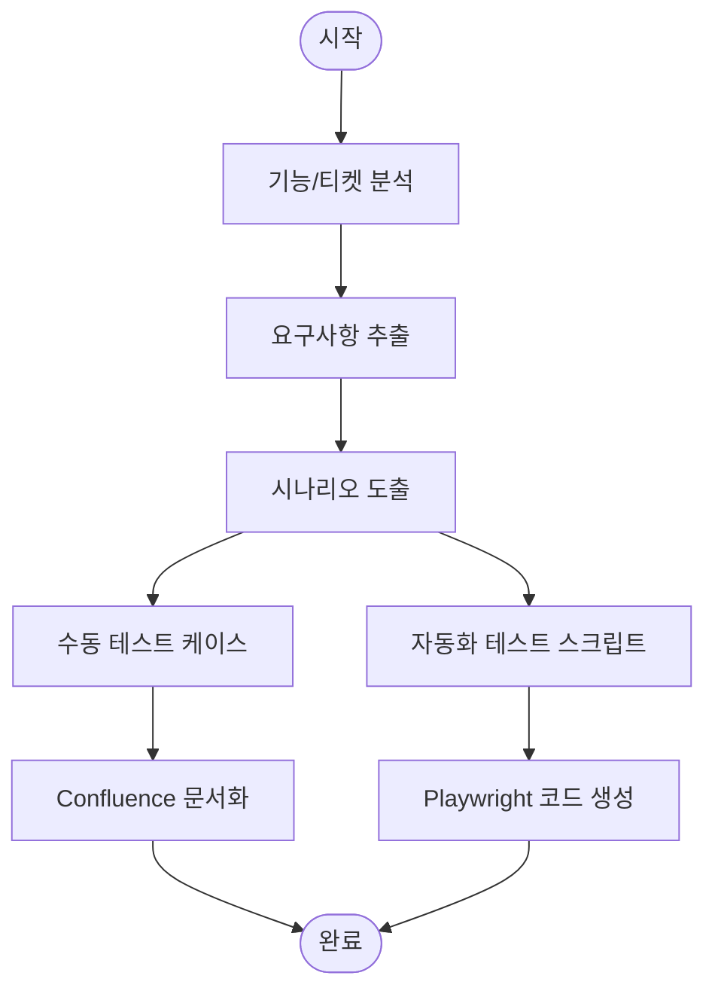

# /qa:scenario

기능에 대한 테스트 시나리오를 자동으로 생성한다. Playwright E2E 테스트 및 수동 테스트용 시나리오를 모두 제공한다.

## Arguments

- $1: 기능명 또는 Jira 티켓 번호 (예: user-login, ECS-123)

## Workflow



## MCP Tools

### Jira
- `jira_get_issue`: 티켓 정보 조회
- `jira_search`: 관련 티켓 검색

### Confluence
- `confluence_create_page`: 테스트 시나리오 문서 생성

### Playwright
- `browser_navigate`: 페이지 이동
- `browser_snapshot`: 현재 상태 캡처
- `browser_click`: 요소 클릭
- `browser_type`: 텍스트 입력

## Instructions

### Step 1: 기능 분석

1. **Jira 티켓인 경우**
   - 티켓 정보 조회
   - Summary, Description, Acceptance Criteria 추출

2. **기능명인 경우**
   - 관련 코드 파일 검색
   - Route, Controller, View 분석

### Step 2: 테스트 시나리오 도출

1. **Happy Path** (정상 흐름)
2. **Alternative Path** (대안 흐름)
3. **Exception Path** (예외 흐름)

### Step 3: 수동 테스트 케이스 작성

각 시나리오에 대해:
- 사전 조건
- 테스트 단계
- 예상 결과

### Step 4: Playwright 자동화 스크립트 생성

1. Page Object Model 적용
2. 재사용 가능한 헬퍼 함수
3. 스크린샷 캡처 포함

## Test Scenario Template

```markdown
# {기능명} 테스트 시나리오

**관련 티켓**: {ECS-XXX}
**작성일**: YYYY-MM-DD

---

## 테스트 케이스

### TC-001: {정상 케이스} [P1]

#### 사전 조건
- 조건 1

#### 테스트 단계
| 단계 | 행동 | 예상 결과 |
|------|------|-----------|
| 1 | {URL} 접속 | 페이지 로드 |
| 2 | {입력} 입력 | 입력 반영 |
| 3 | {버튼} 클릭 | {결과} |

#### 검증 항목
- [ ] 성공 메시지 표시
- [ ] 데이터 저장 확인

---

## Playwright 스크립트

\`\`\`typescript
import { test, expect } from '@playwright/test';

test.describe('{기능명}', () => {
  test('TC-001: 정상 케이스', async ({ page }) => {
    await page.goto('/{path}');
    await page.fill('[name="field"]', 'value');
    await page.click('button[type="submit"]');
    await expect(page).toHaveURL('/success');
  });
});
\`\`\`
```

## Output Format

```
## 테스트 시나리오 생성 완료

### 기능 정보
- **기능명**: {기능명}
- **관련 티켓**: {ECS-XXX}

### 생성된 시나리오
| 우선순위 | 케이스 수 |
|----------|-----------|
| P1 | {N} |
| P2 | {N} |

### 산출물
- [Confluence] 테스트 시나리오 문서
- [Code] Playwright 스크립트
```

## Example

```
/qa:scenario user-login
/qa:scenario ECS-123
```
