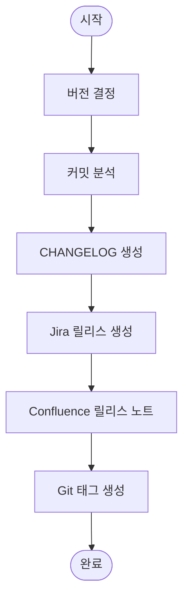

# /release:prepare

릴리스를 준비한다. CHANGELOG 생성, 버전 태깅, Jira 릴리스 생성, Confluence 릴리스 노트를 작성한다.

## Arguments

- $1: 버전 (Semantic Versioning, 예: 1.2.0)
- $2: 릴리스 유형 (선택: major, minor, patch - 기본: minor)

## Versioning Rules

### Semantic Versioning

```
MAJOR.MINOR.PATCH

MAJOR: 호환되지 않는 API 변경
MINOR: 하위 호환 기능 추가
PATCH: 하위 호환 버그 수정
```

### 버전 예시

| 변경 유형 | 이전 버전 | 새 버전 |
|-----------|-----------|---------|
| 버그 수정 | 1.2.3 | 1.2.4 |
| 새 기능 | 1.2.3 | 1.3.0 |
| Breaking Change | 1.2.3 | 2.0.0 |

## Workflow



## MCP Tools

### Jira
- `jira_search`: 릴리스 포함 이슈 조회
- `jira_create_version`: 릴리스 버전 생성
- `jira_update_issue`: Fix Version 설정

### Confluence
- `confluence_create_page`: 릴리스 노트 페이지
- `confluence_search`: 기존 릴리스 노트 확인

### Sentry
- `find_releases`: 기존 릴리스 확인

## Instructions

### Step 1: 버전 결정

1. **현재 버전 확인**
   ```bash
   git describe --tags --abbrev=0 2>/dev/null || echo "v0.0.0"
   ```

2. **새 버전 계산**
   - major: X.0.0
   - minor: X.Y.0
   - patch: X.Y.Z

3. **버전 유효성 검증**
   - 이미 존재하는 태그인지 확인
   - Semantic Versioning 형식 준수

### Step 2: 커밋 분석

1. **마지막 릴리스 이후 커밋 조회**
   ```bash
   git log --oneline $(git describe --tags --abbrev=0)..HEAD
   ```

2. **커밋 분류**
   - `feat:` → Features (새 기능)
   - `fix:` → Bug Fixes (버그 수정)
   - `docs:` → Documentation (문서)
   - `refactor:` → Code Refactoring (리팩토링)
   - `test:` → Tests (테스트)
   - `chore:` → Chores (기타)

3. **Jira 티켓 추출**
   - 커밋 메시지에서 `ECS-XXX` 패턴 추출
   - 중복 제거

### Step 3: CHANGELOG 생성

1. **CHANGELOG.md 업데이트**
   - 최상단에 새 버전 섹션 추가
   - Keep a Changelog 형식 준수

2. **CHANGELOG 형식**
   ```markdown
   ## [X.Y.Z] - YYYY-MM-DD

   ### Added
   - 새로운 기능 설명 ([ECS-XXX])

   ### Changed
   - 변경된 기능 설명 ([ECS-XXX])

   ### Fixed
   - 수정된 버그 설명 ([ECS-XXX])

   ### Removed
   - 제거된 기능 설명
   ```

### Step 4: Jira 릴리스 생성

1. **버전 생성**
   ```
   jira_create_version(
     project_key='ECS',
     name='v{버전}',
     release_date='{오늘 날짜}',
     description='릴리스 설명'
   )
   ```

2. **관련 이슈 업데이트**
   - Fix Version 필드에 새 버전 설정
   - Done 상태 이슈만 대상

### Step 5: Confluence 릴리스 노트

1. **릴리스 노트 페이지 생성**
   - 스페이스: DOCS
   - 부모 페이지: 릴리스 노트 (없으면 생성)
   - 제목: `Release v{버전} ({날짜})`

2. **릴리스 노트 내용**
   ```markdown
   # Release v{버전}

   **릴리스 날짜**: {YYYY-MM-DD}

   ## 요약
   {릴리스 주요 내용 요약}

   ## 주요 변경사항

   ### 새 기능
   | 티켓 | 제목 | 담당자 |
   |------|------|--------|
   | ECS-XX | 기능 설명 | @담당자 |

   ### 버그 수정
   | 티켓 | 제목 | 담당자 |
   |------|------|--------|
   | ECS-XX | 버그 설명 | @담당자 |

   ### 개선사항
   | 티켓 | 제목 | 담당자 |
   |------|------|--------|

   ## 업그레이드 가이드
   {필요한 경우 마이그레이션 안내}

   ## 알려진 이슈
   {해결되지 않은 이슈}

   ## 관련 링크
   - [CHANGELOG](링크)
   - [GitHub Release](링크)
   ```

### Step 6: Git 태그 생성

1. **태그 생성**
   ```bash
   git tag -a v{버전} -m "Release v{버전}"
   ```

2. **태그 푸시** (사용자 확인 후)
   ```bash
   git push origin v{버전}
   ```

### Step 7: 완료 보고

1. **결과 요약 출력**
2. **다음 단계 안내**

## Release Note Template

```markdown
# Release v{VERSION}

**릴리스 날짜**: {DATE}
**이전 버전**: v{PREVIOUS_VERSION}

---

## 하이라이트

{이번 릴리스의 주요 내용 1-3줄 요약}

---

## 변경사항

### ✨ 새 기능 (Features)

| 티켓 | 제목 | 설명 |
|------|------|------|
| [ECS-XX](jira-url) | 기능명 | 간단한 설명 |

### 🐛 버그 수정 (Bug Fixes)

| 티켓 | 제목 | 설명 |
|------|------|------|
| [ECS-XX](jira-url) | 버그명 | 간단한 설명 |

### 🔧 개선사항 (Improvements)

| 티켓 | 제목 | 설명 |
|------|------|------|
| [ECS-XX](jira-url) | 개선 항목 | 간단한 설명 |

### 📚 문서 (Documentation)

- 문서 변경사항

### 🗑️ 제거됨 (Removed)

- 제거된 기능 (있는 경우)

---

## 업그레이드 가이드

### 마이그레이션 필요 사항

```bash
# 마이그레이션 명령어 (있는 경우)
php artisan migrate
```

### Breaking Changes

{호환되지 않는 변경사항 (있는 경우)}

---

## 기여자

{이번 릴리스에 기여한 사람들}

---

## 통계

- **커밋 수**: {N}
- **변경 파일**: {N}
- **추가된 줄**: {N}
- **삭제된 줄**: {N}
- **해결된 이슈**: {N}
```

## Output Format

```
## 릴리스 준비 완료

### 버전 정보
- **새 버전**: v{버전}
- **이전 버전**: v{이전 버전}
- **릴리스 유형**: {major/minor/patch}
- **릴리스 날짜**: {날짜}

### 생성된 항목
- [CHANGELOG.md] 업데이트 완료
- [Jira] 버전 v{버전} 생성
- [Confluence] 릴리스 노트 ({URL})
- [Git] 태그 v{버전} 생성

### 포함된 이슈
| 유형 | 개수 | 티켓 |
|------|------|------|
| Feature | {N} | ECS-XX, ECS-YY |
| Bug Fix | {N} | ECS-ZZ |
| Other | {N} | ECS-AA |

### 다음 단계
1. `git push origin v{버전}` 실행 (태그 푸시)
2. Jenkins 빌드 확인
3. 프로덕션 배포
4. Sentry 릴리스 등록
```

## Example

```
# 마이너 버전 릴리스 (기본)
/release:prepare 1.3.0

# 패치 버전 릴리스
/release:prepare 1.2.4 patch

# 메이저 버전 릴리스
/release:prepare 2.0.0 major
```

## Notes

- 버전 번호는 Semantic Versioning 준수
- CHANGELOG.md가 없으면 새로 생성
- Jira 릴리스는 ECS 프로젝트에 생성
- 태그 푸시는 사용자 확인 후 실행
- 이미 존재하는 태그는 재사용 불가
- Breaking Change가 있으면 major 버전 권장
