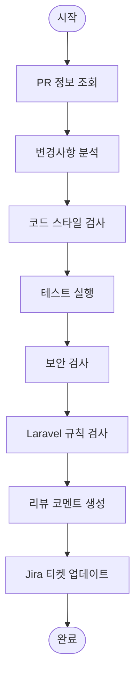

# /review:pr

Pull Request를 자동으로 리뷰한다. 코드 품질, 테스트, 보안을 검사하고 리뷰 코멘트를 생성한다.

## Arguments

- $1: PR 번호 또는 URL (선택, 미입력 시 현재 브랜치의 PR)

## Review Criteria

### 코드 품질
- [ ] 코드 스타일 (Pint)
- [ ] 중복 코드 여부
- [ ] 복잡도 (Cyclomatic Complexity)
- [ ] 네이밍 컨벤션

### 테스트
- [ ] 테스트 존재 여부
- [ ] 테스트 통과 여부
- [ ] 테스트 커버리지

### 보안
- [ ] SQL Injection 취약점
- [ ] XSS 취약점
- [ ] 하드코딩된 시크릿
- [ ] 민감 정보 노출

### Laravel 규칙
- [ ] 약한 결합 (Foreign Key 미사용)
- [ ] SoftDeletes 적용
- [ ] Form Request 사용
- [ ] API Resource 사용

## Workflow



## MCP Tools

### GitHub (Bash)
- `gh pr view`: PR 정보 조회
- `gh pr diff`: 변경사항 조회
- `gh pr comment`: 리뷰 코멘트 추가
- `gh pr checks`: CI 상태 확인

### Jira
- `jira_search`: 관련 티켓 조회
- `jira_add_comment`: 리뷰 결과 기록
- `jira_transition_issue`: 상태 전환 (Code Review → QA)

## Instructions

### Step 1: PR 정보 수집

1. **PR 조회**
   ```bash
   gh pr view {PR번호} --json number,title,body,headRefName,baseRefName,additions,deletions,changedFiles
   ```

2. **변경 파일 목록**
   ```bash
   gh pr diff {PR번호} --name-only
   ```

3. **Jira 티켓 추출**
   - 브랜치명에서 티켓 번호 추출 (예: `feature/ECS-123-...`)
   - PR 제목에서 티켓 번호 추출

### Step 2: 코드 스타일 검사

1. **Pint 실행**
   ```bash
   ./vendor/bin/pint --test
   ```

2. **스타일 위반 목록 수집**
   - 파일별 위반 사항
   - 자동 수정 가능 여부

### Step 3: 테스트 검사

1. **테스트 실행**
   ```bash
   ./vendor/bin/pest --parallel
   ```

2. **테스트 결과 분석**
   - 통과/실패 수
   - 실패한 테스트 목록

3. **커버리지 확인** (선택)
   ```bash
   ./vendor/bin/pest --coverage --min=80
   ```

### Step 4: 보안 검사

1. **변경된 파일 분석**
   - `$_GET`, `$_POST` 직접 사용 여부
   - `DB::raw()` 사용 시 바인딩 확인
   - 하드코딩된 비밀번호/API 키

2. **Laravel 보안 패턴**
   - Form Request 유효성 검사
   - `htmlspecialchars()` 또는 Blade `{{ }}` 사용
   - CSRF 토큰 확인

### Step 5: Laravel 규칙 검사

1. **Migration 검사**
   - `foreignId()->constrained()` 사용 금지
   - `softDeletes()` 포함 여부
   - 적절한 comment 포함

2. **Model 검사**
   - `SoftDeletes` trait 사용
   - `$fillable` 또는 `$guarded` 정의
   - 관계 정의 적절성

3. **Controller 검사**
   - Form Request 사용
   - API Resource 반환
   - 적절한 HTTP 상태 코드

### Step 6: 리뷰 코멘트 생성

1. **종합 평가**
   - ✅ Approve: 모든 검사 통과
   - 🔄 Request Changes: 필수 수정 사항 존재
   - 💬 Comment: 제안 사항만 존재

2. **코멘트 작성**
   ```bash
   gh pr comment {PR번호} --body "{리뷰 내용}"
   ```

### Step 7: Jira 업데이트

1. **리뷰 결과 코멘트**
   ```
   jira_add_comment(issue_key, "PR 리뷰 완료\n- 결과: {Approve/Request Changes}\n- PR: {URL}")
   ```

2. **상태 전환** (Approve 시)
   - Code Review → Ready for QA

## Review Comment Template

```markdown
## PR 리뷰 결과

### 종합 평가: {✅ Approve / 🔄 Request Changes / 💬 Comment}

### 코드 품질
| 항목 | 결과 | 비고 |
|------|------|------|
| Pint 스타일 | ✅/❌ | {위반 수} |
| 중복 코드 | ✅/❌ | {위치} |
| 복잡도 | ✅/❌ | {점수} |

### 테스트
| 항목 | 결과 | 비고 |
|------|------|------|
| 테스트 존재 | ✅/❌ | {파일 수} |
| 테스트 통과 | ✅/❌ | {통과/실패} |
| 커버리지 | ✅/❌ | {%} |

### 보안
| 항목 | 결과 | 비고 |
|------|------|------|
| SQL Injection | ✅/❌ | {위치} |
| XSS | ✅/❌ | {위치} |
| 하드코딩 시크릿 | ✅/❌ | {위치} |

### Laravel 규칙
| 항목 | 결과 | 비고 |
|------|------|------|
| 약한 결합 | ✅/❌ | {위치} |
| SoftDeletes | ✅/❌ | {모델} |
| Form Request | ✅/❌ | {컨트롤러} |

### 상세 피드백

#### 필수 수정 (Must Fix)
- [ ] {항목 1}
- [ ] {항목 2}

#### 권장 수정 (Should Fix)
- [ ] {항목 1}

#### 제안 (Nice to Have)
- {제안 사항}

---
🤖 자동 리뷰 by Claude Code
```

## Output Format

```
## PR 리뷰 완료

### PR 정보
- **번호**: #{PR번호}
- **제목**: {제목}
- **브랜치**: {head} → {base}
- **변경**: +{additions} -{deletions} ({files} files)

### 리뷰 결과
- **종합 평가**: {Approve/Request Changes/Comment}
- **Jira 티켓**: {ECS-XX}

### 검사 결과 요약
| 카테고리 | 결과 |
|----------|------|
| 코드 스타일 | ✅/❌ |
| 테스트 | ✅/❌ |
| 보안 | ✅/❌ |
| Laravel 규칙 | ✅/❌ |

### 다음 단계
- {필요한 조치 또는 QA 진행}
```

## Example

```
# 현재 브랜치 PR 리뷰
/review:pr

# 특정 PR 번호로 리뷰
/review:pr 42

# PR URL로 리뷰
/review:pr https://github.com/owner/repo/pull/42
```

## Notes

- PR이 없는 브랜치에서 실행 시 PR 생성 제안
- CI가 진행 중이면 완료 대기 후 결과 포함
- 리뷰 결과는 항상 Jira 티켓에 기록
- 심각한 보안 이슈 발견 시 즉시 Request Changes
- 자동 리뷰는 휴먼 리뷰를 대체하지 않음 (보조 역할)
