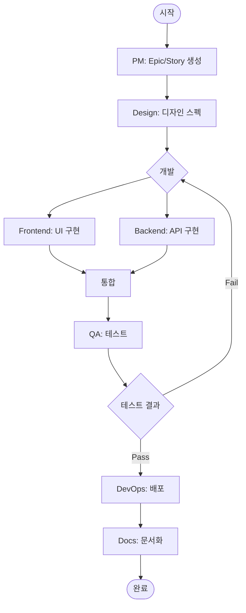

# /workflow:feature

전체 기능 개발 플로우를 조율한다. PM부터 Docs까지 전 단계를 순차적으로 진행한다.

## Arguments

- $1: 기능명 (영문, kebab-case 권장)
- $2: 기능 설명 (한글)

## Development Principles

### 전체 흐름

```
PM → Design → Frontend/Backend (병렬) → QA → DevOps → Docs
```

### 단계별 책임

| 단계 | 담당 | 산출물 |
|------|------|--------|
| 1. 기획 | PM | Epic, Story, 요구사항 문서 |
| 2. 디자인 | Design | 와이어프레임, UI 스펙 |
| 3. 개발 | Frontend/Backend | 코드, API, 테스트 |
| 4. 검증 | QA | 테스트 결과, 버그 리포트 |
| 5. 배포 | DevOps | 배포 완료, 릴리스 |
| 6. 문서화 | Docs | 기술 문서 |

## Workflow



## MCP Tools

### Jira
- `jira_create_issue`: Epic/Story/Task 생성
- `jira_update_issue`: 이슈 업데이트
- `jira_transition_issue`: 상태 전환
- `jira_link_to_epic`: Story를 Epic에 연결

### Confluence
- `confluence_create_page`: 요구사항/스펙 문서
- `confluence_update_page`: 문서 업데이트

### Slack
- `conversations_add_message`: 팀 알림

## Instructions

### Phase 1: PM - 기획

1. **Epic 생성**
   - Jira ECS 프로젝트에 Epic 생성
   - 제목: `[Feature] {기능명}`
   - 설명: 기능 요구사항 상세

2. **요구사항 문서 작성**
   - Confluence DOCS 스페이스에 요구사항 문서 생성
   - 섹션: 배경, 목표, 사용자 스토리, 인수 기준

3. **Story 분해**
   - Epic 하위에 팀별 Story 생성:
     - `[Design] {기능명} 디자인`
     - `[Frontend] {기능명} UI 개발`
     - `[Backend] {기능명} API 개발`
     - `[QA] {기능명} 테스트`
     - `[Docs] {기능명} 문서화`

4. **팀 알림**
   - Slack으로 기능 개발 시작 알림

### Phase 2: Design - 디자인

1. **요구사항 확인**
   - PM이 작성한 요구사항 문서 확인
   - 불명확한 부분 질의

2. **디자인 스펙 작성**
   - 와이어프레임 설명
   - UI 컴포넌트 정의
   - Tailwind CSS 클래스 매핑

3. **Confluence 문서화**
   - 디자인 스펙 페이지 생성
   - 요구사항 문서에 링크

4. **Design Story 완료**
   - Jira 상태 전환: Done
   - Frontend Story 상태 전환: In Progress

### Phase 3: Development - 개발

#### Frontend (Design 완료 후)

1. **디자인 스펙 확인**
2. **Blade 컴포넌트 개발**
3. **Tailwind CSS 적용**
4. **브라우저 테스트** (Playwright)
5. **Frontend Story 완료**

#### Backend (PM 완료 후, TDD 필수)

1. **요구사항 확인**
2. **테스트 작성** (Red)
   ```bash
   ./vendor/bin/pest tests/Feature/{FeatureName}Test.php
   ```
3. **코드 구현** (Green)
   - Migration
   - Model
   - Controller
   - Route
4. **리팩토링** (Refactor)
5. **Backend Story 완료**

### Phase 4: QA - 검증

1. **테스트 시나리오 작성**
   - `/qa:scenario {기능명}`

2. **E2E 테스트 실행**
   - Playwright로 브라우저 테스트
   - 스크린샷 증거 수집

3. **버그 발견 시**
   - Jira Bug 이슈 생성
   - 개발팀 할당
   - 재테스트

4. **QA Story 완료**
   - 테스트 통과 확인
   - Jira 상태 전환: Done

### Phase 5: DevOps - 배포

1. **배포 준비**
   - PR 머지 확인
   - Jenkins 빌드 확인

2. **배포 실행**
   - 스테이징 배포
   - 프로덕션 배포

3. **헬스체크**
   - 서비스 정상 동작 확인
   - Sentry 에러 모니터링

### Phase 6: Docs - 문서화

1. **기술 문서 작성**
   - API 문서 (있는 경우)
   - 아키텍처 다이어그램

2. **사용자 가이드**
   - 기능 사용 방법

3. **Docs Story 완료**

### Phase 7: 완료

1. **Epic 상태 전환**
   - 모든 Story 완료 확인
   - Epic 상태: Done

2. **최종 보고**

## Output Format

```
## Workflow 실행 결과

### Epic
- [ECS-XX] {기능명} - {상태}
- URL: {Jira URL}

### Stories
| 팀 | 티켓 | 상태 |
|----|------|------|
| PM | ECS-XX | Done |
| Design | ECS-XX | Done |
| Frontend | ECS-XX | Done |
| Backend | ECS-XX | Done |
| QA | ECS-XX | Done |
| Docs | ECS-XX | Done |

### 문서
- 요구사항: {Confluence URL}
- 디자인 스펙: {Confluence URL}
- 기술 문서: {Confluence URL}

### 다음 단계
- {남은 작업 또는 후속 조치}
```

## Example

```
/workflow:feature user-profile 사용자 프로필 조회 및 수정 기능
```

## Notes

- 각 Phase는 이전 Phase 완료 후 진행
- Frontend/Backend는 병렬 진행 가능
- QA 실패 시 Development Phase로 회귀
- 모든 단계에서 Jira 상태 업데이트 필수
- TDD는 Backend 개발에서 필수
