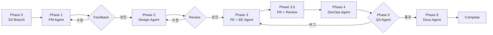

# Claude Code의 Agents, Skills, Commands 완벽 가이드

Claude Code CLI에서 팀 협업과 자동화를 위해 구성할 수 있는 세 가지 핵심 개념인 **Agents**, **Skills**, **Commands**에 대해 알아보고, 실제 프로젝트에서 어떻게 구성하는지 살펴본다.

## 개요

Claude Code는 `.claude/` 디렉토리 내에 마크다운 파일로 정의된 설정을 통해 AI 어시스턴트의 행동을 커스터마이징할 수 있다. 이 구조는 크게 세 가지로 나뉜다:

```
.claude/
├── agents/           # 에이전트 정의 (자율 실행)
├── skills/           # 역할 정의 (컨텍스트/도메인 지식)
├── commands/         # 슬래시 명령어 (사용자 호출)
├── COMPANY.md        # 회사/프로젝트 전역 설정
├── COMPANY.local.md  # 로컬 환경 설정 (gitignore)
└── settings.local.json  # 로컬 권한 설정
```

## 핵심 개념 비교

| 구분 | 목적 | 실행 방식 | 예시 |
|------|------|-----------|------|
| **Agent** | 자율적 작업 수행 | Task tool + context 파일 | PM Agent가 Jira Epic 생성 |
| **Skill** | 역할/도메인 지식 제공 | 컨텍스트 자동 로드 | API 개발자 역할 정의 |
| **Command** | 사용자 직접 호출 | `/namespace:name` 형식 | `/backend:api posts` |

## 1. Agents (에이전트)

### 정의

에이전트는 **자율적으로 복잡한 작업을 수행하는 전문화된 AI 페르소나**다. 각 에이전트는 특정 도메인(백엔드, 프론트엔드, DevOps 등)에 특화되어 있으며, MCP 도구를 활용해 실제 작업을 수행한다.

### 구조

```markdown
# Backend Team Agent

백엔드 개발 자동화 에이전트. Laravel API, 모델, 마이그레이션 개발 수행.

## Identity
- Role: Backend Lead
- Team: Backend
- Skill: `.claude/skills/backend/lead.md`

## Capabilities
- API 엔드포인트 개발
- Eloquent 모델 생성
- 마이그레이션 작성

## MCP Tools
### Jira
- `jira_create_issue`: Backend Task 생성
- `jira_update_issue`: Task 업데이트

### Sentry
- `search_issues`: 에러 검색
- `get_issue_details`: 에러 상세

## Workflow
1. 요구사항 분석
2. 테스트 작성 (TDD)
3. 코드 구현
4. 문서화
```

### 현재 프로젝트의 에이전트 목록

| Agent | 파일 | 역할 | 사용 MCP Tools |
|-------|------|------|----------------|
| PM | `pm.md` | 프로젝트 관리, 요구사항 정의 | Jira, Confluence, Slack |
| Design | `design.md` | UX/UI 디자인 스펙 문서화 | Jira, Confluence |
| Frontend | `frontend.md` | Blade/Tailwind 개발 | Jira, Confluence, Playwright |
| Backend | `backend.md` | Laravel API/DB 개발 (TDD) | Jira, Confluence, Sentry |
| DevOps | `devops.md` | 인프라, CI/CD, 모니터링 | Jira, Confluence, Sentry |
| QA | `qa.md` | 테스트, 품질 보증 | Jira, Playwright, Sentry |
| Docs | `docs.md` | 기술 문서, 다이어그램 | Confluence, Jira |

### 호출 방법

```javascript
// Task tool을 통해 에이전트 호출
Task(
  subagent_type="general-purpose",
  prompt="Backend Agent로서 사용자 인증 API를 구현하라. Context: .claude/agents/backend.md"
)
```

## 2. Skills (스킬)

### 정의

스킬은 **특정 역할의 전문성과 도메인 지식을 정의**한다. 에이전트가 "무엇을 할 수 있는가"를 정의한다면, 스킬은 "어떤 관점과 전문성으로 접근하는가"를 정의한다.

### 구조

```markdown
# API Developer

RESTful API 설계 및 구현.

## Tech Stack
- Laravel 12
- Laravel Sanctum (인증)
- Laravel API Resources
- Form Request (유효성 검증)

## Collaboration
- ↔ Frontend: API 스펙 협의
- → QA: API 테스트 케이스 공유

## Role
- API 엔드포인트 설계
- Request/Response 스펙 정의
- 인증/인가 구현

## Security
- Rate Limiting 적용
- 입력값 검증 철저
- 민감 데이터 마스킹
```

### 현재 프로젝트의 스킬 구조

```
skills/
├── pm/
│   ├── lead.md
│   ├── product-owner.md
│   └── scrum-master.md
├── design/
│   ├── lead.md
│   ├── ux-designer.md
│   └── ui-designer.md
├── backend/
│   ├── lead.md
│   ├── api-developer.md
│   └── db-architect.md
├── frontend/
│   ├── lead.md
│   └── ui-developer.md
├── devops/
│   ├── lead.md
│   ├── infra-engineer.md
│   └── cicd-engineer.md
├── qa/
│   ├── lead.md
│   ├── test-engineer.md
│   └── ux-tester.md
└── docs/
    └── lead.md
```

### Agent와 Skill의 관계

에이전트는 하나 이상의 스킬을 참조할 수 있다:

```markdown
# Backend Team Agent

## Identity
- Role: Backend Lead
- Skill: `.claude/skills/backend/lead.md`  # 기본 스킬 참조
```

## 3. Commands (명령어)

### 정의

커맨드는 **사용자가 직접 슬래시(/) 명령어로 호출하는 작업 템플릿**이다. 반복적인 작업을 표준화하고 일관된 결과를 보장한다.

### 구조

```markdown
# /backend:api

API 엔드포인트를 생성한다.

## Arguments
- resource: 리소스명 (예: posts, users)

## Instructions
1. 리소스에 대한 RESTful 엔드포인트를 설계한다
2. Controller, Request, Resource를 생성한다
3. 라우트를 등록한다
```

### 현재 프로젝트의 커맨드 목록

| 네임스페이스 | 명령어 | 파일 | 용도 |
|-------------|--------|------|------|
| pm | `/pm:status` | pm/status.md | 프로젝트 현황 확인 |
| pm | `/pm:plan` | pm/plan.md | 스프린트 계획 |
| design | `/design:mockup` | design/mockup.md | UI 목업 생성 |
| design | `/design:wireframe` | design/wireframe.md | 와이어프레임 생성 |
| frontend | `/frontend:component` | frontend/component.md | 컴포넌트 생성 |
| frontend | `/frontend:page` | frontend/page.md | 페이지 생성 |
| backend | `/backend:api` | backend/api.md | API 엔드포인트 생성 |
| backend | `/backend:model` | backend/model.md | Eloquent 모델 생성 |
| backend | `/backend:migration` | backend/migration.md | 마이그레이션 생성 |
| backend | `/backend:service` | backend/service.md | 서비스 클래스 생성 |
| devops | `/devops:deploy` | devops/deploy.md | 배포 실행 |
| devops | `/devops:docker` | devops/docker.md | Docker 환경 관리 |
| qa | `/qa:checklist` | qa/checklist.md | QA 체크리스트 생성 |
| qa | `/qa:scenario` | qa/scenario.md | 테스트 시나리오 생성 |
| docs | `/docs:page` | docs/page.md | Confluence 페이지 생성 |
| docs | `/docs:diagram` | docs/diagram.md | Mermaid 다이어그램 추가 |
| - | `/new-feature` | new-feature.md | 전체 워크플로우 실행 |

### 호출 방법

```bash
# 채팅에서 직접 호출
/backend:api posts

# 인자와 함께 호출
/new-feature user-authentication "사용자 인증 기능"
```

## 4. 세 요소의 관계도

```
┌─────────────────────────────────────────────────────────────┐
│                        Commands                              │
│  (사용자가 /slash 명령으로 직접 호출)                          │
│                                                              │
│  /new-feature ─┬→ PM Agent                                   │
│                ├→ Design Agent                               │
│                ├→ Frontend Agent                             │
│                ├→ Backend Agent                              │
│                ├→ DevOps Agent                               │
│                ├→ QA Agent                                   │
│                └→ Docs Agent                                 │
└──────────────────────────┬──────────────────────────────────┘
                           │ 호출
                           ▼
┌─────────────────────────────────────────────────────────────┐
│                         Agents                               │
│  (자율적으로 작업 수행)                                        │
│                                                              │
│  Backend Agent ──참조──→ backend/lead.md (Skill)             │
│       │                  backend/api-developer.md (Skill)   │
│       │                                                      │
│       └──사용──→ MCP Tools (Jira, Confluence, Sentry)        │
└─────────────────────────────────────────────────────────────┘
                           │ 참조
                           ▼
┌─────────────────────────────────────────────────────────────┐
│                         Skills                               │
│  (도메인 지식 및 전문성 정의)                                  │
│                                                              │
│  - Tech Stack 정보                                           │
│  - 협업 관계                                                  │
│  - 보안 가이드라인                                            │
│  - 코딩 스타일                                                │
└─────────────────────────────────────────────────────────────┘
```

## 5. MCP (Model Context Protocol) 통합

### MCP 서버 설정 (.mcp.json)

```json
{
  "mcpServers": {
    "slack": {
      "type": "stdio",
      "command": "npx",
      "args": ["-y", "slack-mcp-server@latest", "--transport", "stdio"],
      "env": {
        "SLACK_MCP_XOXB_TOKEN": "xoxb-..."
      }
    },
    "sentry": {
      "type": "stdio",
      "command": "npx",
      "args": ["@sentry/mcp-server@latest", "--access-token=...", "--host=..."]
    },
    "atlassian": {
      "type": "stdio",
      "command": "uvx",
      "args": ["mcp-atlassian"],
      "env": {
        "JIRA_URL": "https://xxx.atlassian.net",
        "JIRA_USERNAME": "...",
        "JIRA_API_TOKEN": "...",
        "CONFLUENCE_URL": "https://xxx.atlassian.net/wiki",
        "CONFLUENCE_USERNAME": "...",
        "CONFLUENCE_API_TOKEN": "..."
      }
    }
  }
}
```

### 에이전트에서 MCP 도구 활용

각 에이전트는 해당 도메인에 필요한 MCP 도구를 명시적으로 선언한다:

```markdown
## MCP Tools

### Jira (작업 관리)
- `jira_create_issue`: 이슈 생성
- `jira_update_issue`: 이슈 업데이트
- `jira_transition_issue`: 상태 전환
- `jira_add_comment`: 코멘트 추가

### Confluence (문서)
- `confluence_create_page`: 페이지 생성
- `confluence_update_page`: 페이지 업데이트

### Sentry (모니터링)
- `search_issues`: 에러 검색
- `get_issue_details`: 에러 상세
- `analyze_issue_with_seer`: AI 에러 분석

### Playwright (E2E 테스트)
- `browser_navigate`: 페이지 이동
- `browser_snapshot`: 스냅샷 캡처
- `browser_click`: 클릭 테스트
```

## 6. 워크플로우 예시: /new-feature

`/new-feature` 커맨드는 모든 에이전트가 협업하는 전체 개발 워크플로우를 보여준다:



### 실행 순서

1. **Phase 0**: Git feature 브랜치 생성
2. **Phase 1**: PM Agent - PRD 문서 작성
3. **Phase 1.5**: 피드백 수집 및 승인
4. **Phase 2**: Design Agent - UI/UX 스펙 작성
5. **Phase 2.5**: 디자인 리뷰 및 승인
6. **Phase 3**: Frontend/Backend Agent 병렬 개발 (TDD)
7. **Phase 3.5**: PR 생성 및 코드 리뷰
8. **Phase 4**: DevOps Agent - 인프라 설정
9. **Phase 5**: QA Agent - E2E 테스트
10. **Phase 6**: Docs Agent - 문서 정리

## 7. 프로젝트별 커스터마이징

### COMPANY.md (공유 설정)

```markdown
# Company Profile

소규모 기업. 자체 온프레미스 서버 운영.

## Infrastructure
- 온프레미스 단일 서버 환경
- OS: Ubuntu 24.04 LTS

## Services
| 서비스 | 용도 |
|--------|------|
| Jenkins | CI/CD |
| MinIO | 오브젝트 스토리지 |
| Sentry | 에러 트래킹 |
| PostgreSQL | 메인 DB |
| Redis | 캐시/세션/큐 |

## Project Management
| 도구 | URL | 용도 |
|------|-----|------|
| Jira | https://xxx.atlassian.net | 이슈 관리 |
| Confluence | https://xxx.atlassian.net/wiki | 문서 관리 |
```

### settings.local.json (로컬 권한)

```json
{
  "permissions": {
    "allow": [
      "Bash(git init:*)",
      "WebFetch(domain:docs.sentry.io)",
      "WebFetch(domain:github.com)"
    ]
  }
}
```

## 8. 베스트 프랙티스

### Agent 설계 원칙

1. **단일 책임**: 각 에이전트는 하나의 도메인에 집중
2. **명확한 출력 형식**: 작업 결과를 일관된 형식으로 보고
3. **MCP 도구 명시**: 사용할 도구를 명확히 선언
4. **워크플로우 정의**: 단계별 작업 순서 문서화

### Skill 설계 원칙

1. **역할 기반**: 특정 역할의 전문성에 집중
2. **협업 관계 명시**: 다른 역할과의 인터페이스 정의
3. **기술 스택 명시**: 사용하는 기술 명확히 문서화

### Command 설계 원칙

1. **네임스페이스 활용**: `namespace:action` 형식으로 그룹화
2. **인자 문서화**: 필요한 인자와 형식 명시
3. **단계별 지시사항**: 실행 순서 명확히 정의

## 결론

Claude Code의 Agents, Skills, Commands 시스템은 AI 어시스턴트를 팀의 개발 프로세스에 깊이 통합할 수 있게 해준다. 각 개념은 서로 보완적인 역할을 하며:

- **Commands**는 사용자의 진입점을 제공하고
- **Agents**는 실제 작업을 자율적으로 수행하며
- **Skills**는 필요한 전문성과 맥락을 제공한다

이 세 요소를 적절히 조합하면 반복적인 작업을 자동화하고, 팀 전체의 일관된 개발 프로세스를 유지할 수 있다.
